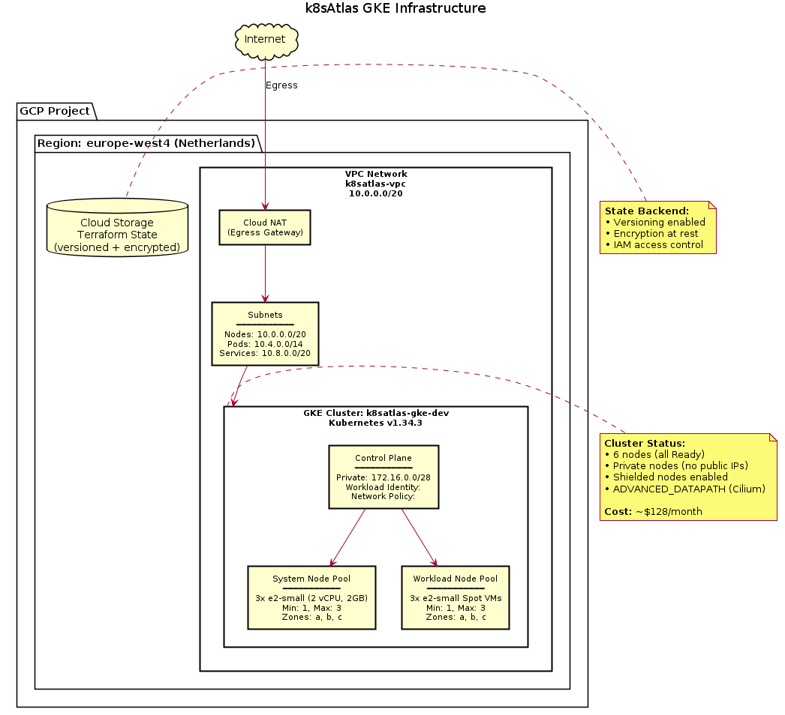

# k8sAtlas

**Production-Ready Google Kubernetes Engine (GKE) Platform**

A comprehensive Kubernetes platform on Google Cloud Platform (GCP).

## Overview

k8sAtlas is a fully-automated Kubernetes infrastructure project built with Terraform, featuring:

- **Private GKE cluster** with proper networking and security controls
- **Infrastructure as Code** - Everything managed via Terraform
- **Production-grade platform services** - Ingress, TLS automation, DNS management
- **Complete observability stack** - Prometheus, Grafana, Loki, Alertmanager
- **CI/CD pipeline** - Automated build, test, scan, and deployment
- **Security hardening** - Network policies, RBAC, secrets management
- **Real application** - Go REST API with database integration

This is not a toy project. It's a production-ready platform that could be forked and used as a foundation for real applications.

## Architecture

### Infrastructure Diagram



*Current deployment: Phase 0 (Bootstrap) & Phase 1 (Core Infrastructure)*

**To generate/update the diagram:**
```bash
bash scripts/generate-diagram.sh
```

### Traffic Flow (Phase 2+)

```
Internet → Cloudflare CDN → GCP Load Balancer → NGINX Ingress → Services → Pods
```

### Current Components (Phase 0-1)

**✅ Deployed:**
- **VPC Network**: Custom networking (10.0.0.0/20) with separate ranges for pods and services
- **Private GKE Cluster**: 6 nodes (3 system + 3 workload Spot VMs)
  - Kubernetes v1.34.3
  - Workload Identity enabled
  - Network policies (Cilium)
  - Shielded nodes
- **Cloud NAT**: Enables egress for private nodes
- **Cloud Storage**: Terraform state backend
- **Cost**: ~$128/month

**🔜 Phase 2 (Ready to Deploy):**
- **NGINX Ingress Controller**: GCP LoadBalancer integration
- **Cert-Manager**: Automatic TLS certificates via Let's Encrypt
- **Cloudflare Integration**: DNS management and CDN
- **Additional Cost**: +$23-28/month

**📋 Future Phases:**
- **Phase 3**: Application deployment (Go REST API)
- **Phase 4**: Observability (Prometheus, Grafana, Loki)
- **Phase 5**: Security hardening
- **Phase 6**: CI/CD pipeline

## Repository Structure

```
k8sAtlas/
├── terraform/              # Infrastructure as Code
│   ├── modules/           # Reusable Terraform modules
│   │   ├── vpc/
│   │   ├── gke/
│   │   ├── iam/
│   │   └── artifact_registry/
│   └── environments/      # Environment-specific configurations
│       ├── dev/
│       └── prod/
├── k8s/                   # Kubernetes manifests
│   ├── base/             # Base configurations
│   ├── apps/             # Application deployments
│   └── platform/         # Platform services
├── app/                   # Go REST API application
├── scripts/               # Automation scripts
├── docs/                  # Documentation
├── .github/workflows/     # CI/CD pipelines
├── Makefile              # Common automation commands
└── PROJECT_PLAN.md       # Detailed implementation plan
```

## Prerequisites

See **[host_requirements.md](host_requirements.md)** for detailed system requirements and installation instructions.

**Quick check:**
- Google Cloud Platform account with billing enabled
- gcloud CLI (≥ 550.0) - authenticated
- Terraform (≥ 1.5.0)
- kubectl (≥ 1.33.0)
- gke-gcloud-auth-plugin
- Helm (≥ 3.12.0)
- Git, Make

**Verify all requirements:**
```bash
./scripts/check-requirements.sh
```

## Quick Start

### 1. Bootstrap GCP Environment

Set up GCS bucket for Terraform state and enable required APIs:

```bash
# Configure your GCP project
export GCP_PROJECT_ID="your-project-id"
gcloud config set project $GCP_PROJECT_ID

# Run bootstrap
make bootstrap
```

### 2. Initialize Terraform

```bash
make init
```

### 3. Configure Variables

Create `terraform/environments/dev/terraform.tfvars`:

```hcl
project_id = "your-project-id"
region     = "europe-west1"
```

### 4. Deploy Infrastructure

```bash
# Preview changes
make plan

# Apply changes (creates GKE cluster, VPC, etc.)
make apply
```

### 5. Configure kubectl

```bash
make kubeconfig
```

### 6. Verify Cluster

```bash
kubectl get nodes
kubectl get namespaces
```

## Available Commands

Display all available commands:

```bash
make help
```

Key commands:

| Command | Description |
|---------|-------------|
| `make bootstrap` | Set up GCP environment (first-time setup) |
| `make init` | Initialize Terraform |
| `make plan` | Preview infrastructure changes |
| `make apply` | Deploy infrastructure |
| `make destroy` | Destroy all resources |
| `make kubeconfig` | Configure kubectl access |
| `make status` | Show cluster status |
| `make port-forward-grafana` | Access Grafana dashboards |
| `make logs-app` | View application logs |

## Cost Estimation

Approximate monthly costs (varies by region and usage):

- **Minimal setup** (dev): ~$170-230/month
  - GKE cluster: ~$100-150
  - Load Balancer: ~$20-30
  - NAT Gateway: ~$30-40
  - Persistent storage: ~$10-20

- **With Cloud SQL**: +$50-100/month
- **With high availability**: 2-3x costs

**Cost optimization tips**:
- Use preemptible/spot nodes for non-production workloads
- Run `make destroy` when not actively developing
- Set up billing alerts (included in bootstrap script)

## License

MIT License - See [LICENSE](LICENSE) for details.


---

**Important**: This project creates real GCP resources that incur costs. Always run `make destroy` when finished to avoid unexpected charges. Set up billing alerts in the GCP console.
